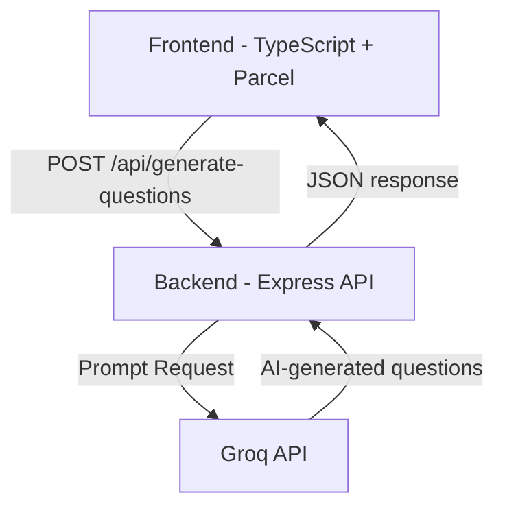

# Interview Question Generator

Full-stack application that generates 3 tailored interview questions based on a job title and difficulty tier, powered by Groq's LLaMA 3.3 70B model.
 The platform allows users to enter a role such as **Customer Success Manager**, **Frontend Engineer**, or **Product Manager** and instantly receive thoughtful, role-specific interview questions generated in real time.

The project demonstrates:

* Full-stack TypeScript architecture
* AI API integration
* REST API design
* Schema validation
* Interactive Swagger documentation
* Modern UI/UX patterns
* Clean project organization

---

## Features

* Generate 3 AI-powered interview questions
* Groq LLM integration
* Vanilla TypeScript frontend
* Express + TypeScript backend
* Swagger API documentation
* Zod schema validation
* Bento-style responsive UI
* Copy-to-clipboard interaction
* Loading and latency states
* Environment-based configuration
* Production-ready structure

---

## Tech Stack

### Frontend

* TypeScript
* HTML5
* CSS3
* Parcel

### Backend

* Node.js
* Express
* TypeScript
* Zod
* Swagger UI

### AI

* Groq API
* Llama 3 / Mixtral models

### Tooling

* Yarn
* Biome
* dotenv

### Deployment

* Vercel

---

## Project Structure

```text
interview-generator/

├── src/
│   ├── main.ts          ← Frontend logic (fetch, DOM, latency tracking)
│   └── style.css        ← Bento grid UI styles
├── index.html           ← App shell
├── server.ts            ← Express API + Groq integration
├── vite.config.ts       ← Vite + proxy config
├── tsconfig.json        ← TypeScript config
├── package.json         ← Dependencies and scripts
├── yarn.lock            ← Locked dependency versions
├── .env.example         ← Environment variable template
├── .gitignore
└── README.md
```

---

## Architecture Overview



---

## Quick Start

### Prerequisites

* Node.js v18+
* Yarn
* Groq API key (free, no credit card required)

Create a free API key at:

[https://console.groq.com](https://console.groq.com)

---

## Setup

Clone the repository:

```bash
git clone https://github.com/azukauteh/interview-generator.git
cd interview-generator
```

Install dependencies:

```bash
yarn install
```

Create environment variables:

```bash
cp .env.example .env
```

Add your API key to `.env`:

```env
GROQ_API_KEY=your_groq_api_key_here
PORT=3000
NODE_ENV=development
```

---

## Running the Application

Start the development server:

```bash
yarn dev
```

### Local URLs

| Service      | URL                                                      |
| ------------ | -------------------------------------------------------- |
| Frontend App | [http://localhost:5173](http://localhost:5173)           |
| Backend API  | [http://localhost:3000](http://localhost:3000)           |
| Swagger Docs | [http://localhost:3000/docs](http://localhost:3000/docs) |

---

## Production Build

Build the application:

```bash
yarn build
```

Start production server:

```bash
yarn start
```

---

## API Reference

### POST `/api/generate-questions`

Generate AI-powered interview questions based on a job title.

### Request Body

| Field            | Type                   | Required | Description                  |
| ---------------- | ---------------------- | -------- | ---------------------------- |
| `jobTitle`       | string                 | ✅        | Job title (2–100 characters) |
| `difficultyTier` | `Standard \| Advanced` | ❌        | Defaults to `Standard`       |

---

### Example Request

```json
{
  "jobTitle": "Customer Success Manager",
  "difficultyTier": "Advanced"
}
```

---

### Example Response

```json
{
  "questions": [
    "How do you identify early churn signals across a large portfolio?",
    "Describe a time you influenced product roadmap based on customer feedback.",
    "How do you balance reactive support with proactive success management?"
  ]
}
```

---

## Validation & Error Handling

The backend validates all incoming requests using Zod schemas.

Examples:

* Empty job titles are rejected
* Invalid payload structures return proper HTTP errors
* AI provider failures are gracefully handled

---

## Swagger Documentation

Interactive API documentation is available at:

```text
http://localhost:3000/docs
```

Swagger provides:

* Endpoint testing
* Request/response schemas
* API exploration
* Error response documentation

---

## Development Scripts

### Development

```bash
yarn dev
```

### Build

```bash
yarn build
```

### Start Production

```bash
yarn start
```

### Type Checking

```bash
yarn typecheck
```

### Linting

```bash
yarn lint
```

---

## Deployment

The application can be deployed using:

* Vercel
* Render
* Railway

Ensure the following environment variables are configured in production:

```env
GROQ_API_KEY=
PORT=
NODE_ENV=production
```

---

## Contributing

1. Fork the repository
2. Create a feature branch

```bash
git checkout -b feat/your-feature
```

3. Commit your changes

```bash
git commit -m "feat: your feature"
```

4. Push your branch

```bash
git push origin feat/your-feature
```

5. Open a Pull Request

---
### Screenshots


### Live Demo
https://www.loom.com/share/3400e33a76f04671991e17ac86eca70e


## Future Improvements

* Multiple AI provider support
* Question difficulty tuning
* Interview answer evaluation
* Saved interview sessions
* PDF export support
* Streaming AI responses

---

## License

MIT

---

Built with Groq · Express · TypeScript · Parcel

