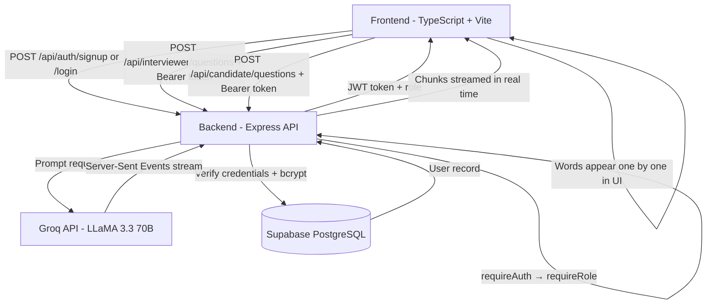

## Interviewer.ai

Interviewer.ai is a full-stack role-based platform that generates tailored interview questions 
and candidate prep answers in real time, powered by Groq's LLaMA 3.3 70B model.

Interviewers enter a job title and difficulty tier to generate 3 role-specific questions. 
Candidates enter their target role and receive 3 questions with AI-generated sample answers 
to help them prepare — streamed word by word as they generate.

The project demonstrates:

- Full-stack TypeScript architecture (vanilla frontend, Express backend)
- Role-based JWT authentication (Interviewer and Candidate)
- AI API integration with real-time streaming via Server-Sent Events
- REST API design with Zod validation on every endpoint
- PostgreSQL database via Supabase with connection pooling
- Interactive Swagger UI with Bearer token support
- Bento-style responsive UI with Poppins typography
- 13 unit tests covering schema validation and response parsing
- Clean modular project organization with middleware, routes, utils, and pages

---

## Features

- Role-based authentication (Interviewer and Candidate)
- JWT access tokens with bcrypt password hashing
- Interviewer dashboard — generate 3 role-specific questions by job title
- Candidate prep page — generate questions with AI sample answers
- Standard and Advanced difficulty tiers
- Copy-to-clipboard on each question card
- Real-time API latency tracking
- Swagger UI at `/docs` with Bearer token auth support
- Zod request validation on all endpoints
- Supabase PostgreSQL database (users and interviews tables)
- Bento-style responsive UI with Poppins font
- Logout with role-based redirect
- Descriptive error messages (duplicate email, invalid credentials)
- 13 unit tests — schema validation and response parsing
---

## Tech Stack

### Frontend

* TypeScript
* HTML5
* CSS3
* Vite

### Backend

* Node.js
* Express
* TypeScript
* Zod
* Swagger UI

### AI

* Groq API
* Llama 3 / Mixtral models


### Tooling

* Yarn
* Biome
* dotenv

### Deployment

* Render
  
### Auth & Database

| Tool | Purpose |
| --- | --- |
| [JWT](https://jwt.io) | Access token generation and verification |
| [bcryptjs](https://github.com/dcodeIO/bcrypt.js) | Password hashing |
| [Supabase](https://supabase.com) | PostgreSQL cloud database |
| [pg](https://node-postgres.com) | PostgreSQL client for Node.js |

---

## Project Structure

```
interview-generator/
├── public/
│   ├── index.html           ← Login page
│   ├── interviewer.html     ← Interviewer dashboard
│   └── candidate.html       ← Candidate prep page
├── src/
│   ├── docs/
│   │   └── swagger.ts       ← OpenAPI 3.0 spec
│   ├── middleware/
│   │   ├── requireAuth.ts   ← JWT verification
│   │   └── requireRole.ts   ← Role enforcement
│   ├── pages/
│   │   ├── login.ts         ← Login/signup frontend logic
│   │   ├── interviewer.ts   ← Interviewer page frontend logic
│   │   └── candidate.ts     ← Candidate page frontend logic
│   ├── routes/
│   │   ├── auth.ts          ← POST /api/auth/signup, /login
│   │   ├── interviewer.ts   ← POST /api/interviewer/questions
│   │   └── candidate.ts     ← POST /api/candidate/questions
│   ├── types/
│   │   └── express.d.ts     ← Express Request type extension
│   ├── utils/
│   │   ├── db.ts            ← Supabase/Postgres pool
│   │   ├── jwt.ts           ← Token sign/verify helpers
│   │   └── password.ts      ← bcrypt helpers
│   └── style.css            ← Global styles
├── tests/
│   └── server.test.ts       ← 13 unit tests (Vitest)
├── server.ts                ← Express entry point
├── vite.config.ts           ← Vite + proxy config
├── tsconfig.json            ← TypeScript config
├── biome.json               ← Linter/formatter config
├── package.json
├── .env.example
└── README.md
```


## Architecture Overview



---

## Quick Start

### Prerequisites

* Node.js v18+
* Yarn
* Groq API key (free, no credit card required)

Create a free API key at:

[https://console.groq.com](https://console.groq.com)

---

## Setup

Clone the repository:

```bash
git clone https://github.com/azukauteh/interview-generator.git
cd interview-generator
```

Install dependencies:

```bash
yarn install
```

Create environment variables:

```bash
cp .env.example .env
```

Add your API key to `.env`:

```env
GROQ_API_KEY=your_groq_api_key_here
DATABASE_URL=your_supabase_pooler_connection_string
JWT_SECRET=your_jwt_secret_here
PORT=3000
NODE_ENV=development
```

---

## Running the Application

Start the development server:

```bash
yarn dev
```

### Local URLs

| Service      | URL                                                      |
| ------------ | -------------------------------------------------------- |
| Frontend App | [http://localhost:5173](http://localhost:5173)           |
| Backend API  | [http://localhost:3000](http://localhost:3000)           |
| Swagger Docs | [http://localhost:3000/docs](http://localhost:3000/docs) |

---

## Production Build

Build the application:

```bash
yarn build
```

Start production server:

```bash
yarn start
```

---

## API Reference

All protected endpoints require a Bearer token in the `Authorization` header:
Authorization: Bearer <your_jwt_token>

Full interactive docs available at `http://localhost:3000/docs`.

---

### POST `/api/auth/signup`

| Field | Type | Required | Description |
| --- | --- | --- | --- |
| `email` | string | ✅ | Valid email address |
| `password` | string | ✅ | Minimum 8 characters |
| `role` | `interviewer \| candidate` | ✅ | User role |

**Response:** `{ token, role }`

---

### POST `/api/auth/login`

| Field | Type | Required | Description |
| --- | --- | --- | --- |
| `email` | string | ✅ | Registered email |
| `password` | string | ✅ | Account password |
| `role` | `interviewer \| candidate` | ✅ | Must match registered role |

**Response:** `{ token, role }`

---

### POST `/api/interviewer/questions` 🔒

| Field | Type | Required | Description |
| --- | --- | --- | --- |
| `jobTitle` | string | ✅ | Job title (2–100 characters) |
| `difficultyTier` | `Standard \| Advanced` | ❌ | Defaults to `Standard` |

**Response:** `{ questions: string[] }`

---

### POST `/api/candidate/questions` 🔒

| Field | Type | Required | Description |
| --- | --- | --- | --- |
| `jobRole` | string | ✅ | Target role (2–100 characters) |

**Response:** `{ questions: string[], answers: string[] }`

---

🔒 Requires valid JWT with matching role. Returns `401` if token missing, `403` if wrong role.

---


### Development

```bash
yarn dev
```

### Build

```bash
yarn build
```

### Start Production

```bash
yarn start
```

### Type Checking

```bash
yarn typecheck
```

### Linting

```bash
yarn lint
```

---

## Deployment

The application is deployed using:

* Render


---
### Screenshots


## Future Improvements

* Multiple AI provider support
* Question difficulty tuning
* Interview answer evaluation
* Saved interview sessions
* PDF export support
* Streaming AI responses
* Per-card question regeneration, refresh a single question without losing the others
* Regenerate all  re-run the same role with one click for fresh results
* Question history  save and revisit previous generations per session


---

## License

MIT

---

Built with Groq · Express · TypeScript · Vite


